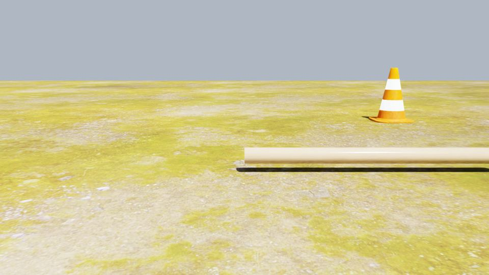
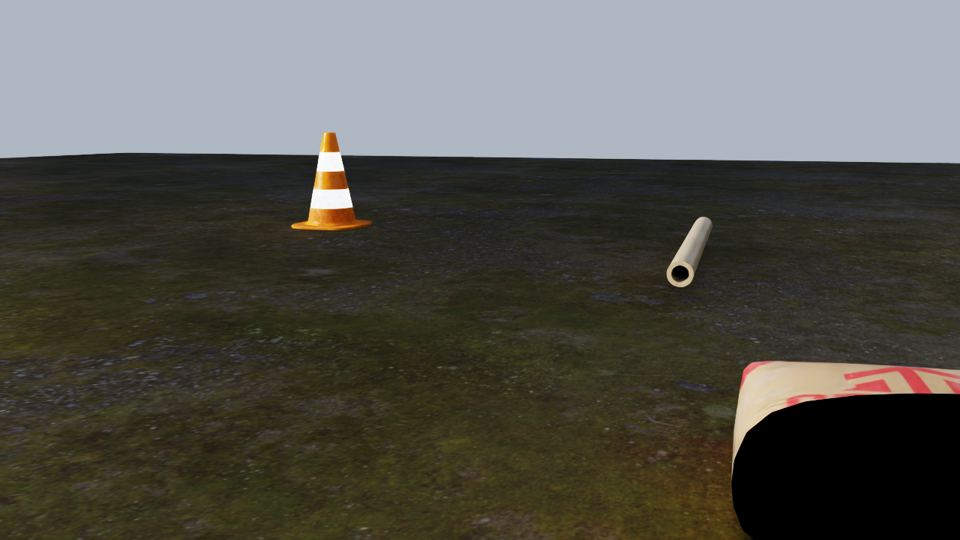
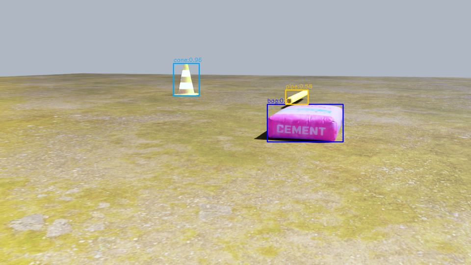
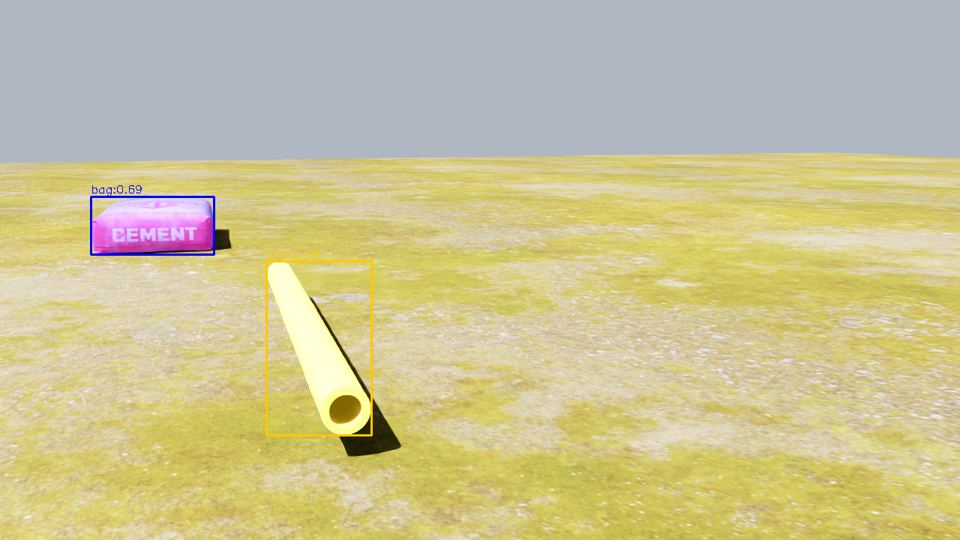
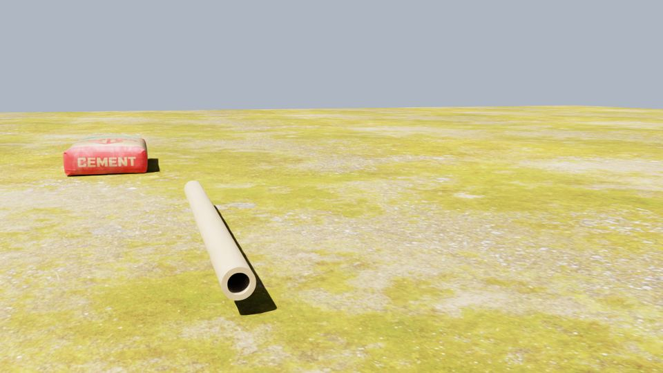
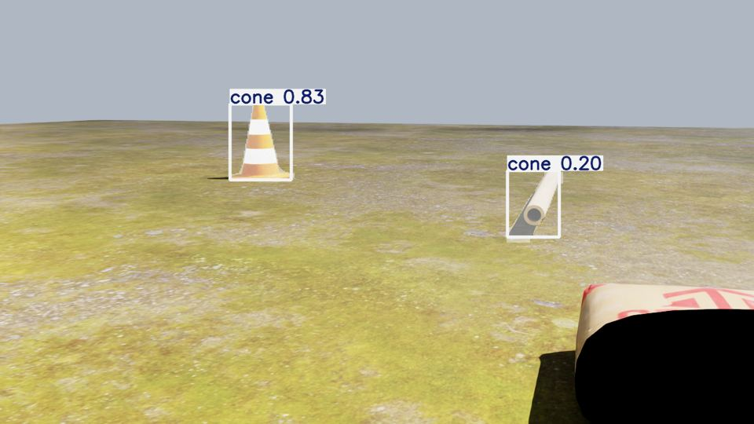

# Task 6: SAM3/YOLOE Render-Quality Gate — Report

**Verdict: NO-GO (strict), but with a specific, likely-fixable root cause —
escalating to harelb per the brief, with a concrete recommendation below
rather than a call to redesign the environment strategy.**

## TL;DR

- Isaac Sim 6.0.1.0 RTX renders of a simple outdoor test scene (photoreal
  ground material + 3 real-world-scale props) are clean, sharp, and
  well-lit — **rendering fidelity is not the bottleneck**.
- **SAM3** (open-vocab text-prompt segmentation) finds the target objects
  at 40-85% hit rates across 20 viewpoints, with visually tight, accurate
  masks. This is the gate's core question — "can zero-shot segmentation
  work on these renders at all" — and the answer is yes.
- **YOLOE**, using the *exact* weights and class list the real
  `spot_executor` detector uses (`yoloe-26m-seg.pt`,
  `["", "bag", "cone", "pipe"]`), finds **cone in 70% of frames (14/20)
  but bag and pipe in 0/20 frames** at the operating threshold. A
  diagnostic at a near-zero confidence threshold shows YOLOE *does*
  localize the bag and pipe correctly (bounding boxes land right on
  them) but assigns them only 1-3% class confidence — i.e. this looks
  like a text-embedding/vocabulary mismatch for these two class names
  against these object appearances, not a rendering-quality or
  localization failure.
- The brief's GO criterion is written as YOLOE-specific
  ("YOLOE finds the graspable objects in ≥70% of frames..."), and bag/pipe
  fail that outright, so the mechanical answer is **NO-GO**. But the
  underlying cause is narrower than "the photorealism assumption is
  broken" (the brief's stated reason to revisit environment strategy) —
  see **Recommendation** below.

## 1. Assets used (full detail in `dcist_sim/scenarios/assets/SOURCES.md`)

| Object/surface | Source | License | Notes |
|---|---|---|---|
| Traffic cone | NVIDIA Isaac Nucleus `Isaac/Environments/Simple_Warehouse/Props/S_TrafficCone.usd` | NVIDIA Omniverse asset license | referenced by URL, not downloaded |
| Pipe | NVIDIA Isaac Nucleus `Isaac/Props/DeformableTube/tube.usd` | NVIDIA Omniverse asset license | scaled 4x (authored ~0.02m dia -> ~0.08m) |
| Bag | Poly Haven "Cement Bag" (`cement_bag`) | CC0 | stand-in for "bag" class — see concerns |
| Ground material | Poly Haven "Aerial Grass Rock" (`aerial_grass_rock`) | CC0 | hand-authored `UsdPreviewSurface` on a flat 20x20m quad |

**Rejected**: `Isaac/Environments/Outdoor/Rivermark/rivermark.usd`, the
official photoreal outdoor demo scene — `world.reset()` hung indefinitely
(0% GPU utilization, log flooded with
`PopulatePointInstancerBucket invalid protoIndex ... numPrototypes=0`
warnings from its foliage point-instancer). Looks like an asset bug in
this specific Rivermark build under Isaac 6.0.1.0. Fell back to the
brief's sanctioned alternative: flat ground + PBR material + scattered
objects.

Total downloaded size: ~9.5MB, committed directly (no gitignore needed).

## 2. Render pipeline

`dcist_sim/dcist_sim_isaac/dcist_sim_isaac/scripts/render_gate.py` —
standalone, headless, no ROS. Builds the scene once, then captures 20
frames: 5 azimuths (0/72/144/216/288 degrees) x 2 distances (2.5m, 4.5m)
x 2 sun configs, camera at Spot camera height (0.5m) with a 10 degree
downward pitch, always looking at the object cluster center.

```bash
source ~/environments/dcist/isaac_sim/bin/activate
export OMNI_KIT_ACCEPT_EULA=YES PRIVACY_CONSENT=Y
cd ~/dcist_ws/src/awesome_dcist_t4
PYTHONPATH=dcist_sim/dcist_sim_isaac \
  python -m dcist_sim_isaac.scripts.render_gate --out /tmp/render_gate
```

### Bugs found and fixed while building this

1. **~2.8-degree soda-straw FOV.** Isaac's `Camera.set_focal_length(24.0)`
   paired with this Camera wrapper's default aperture (reported as
   ~2.1mm/1.53mm, not the "20.955mm" a naive USD-camera reading would
   suggest) produced an extreme telephoto lens. Every render was a
   close-up of whatever tiny patch of ground happened to be dead-center —
   no horizon, no objects, just blurry-looking (actually just extremely
   zoomed-in) grass texture. Fixed by using `focal_length=1.8` to match
   the aperture's apparent unit scale, giving a sane ~60x36 degree FOV.
   Confirmed via a rotation-matrix probe that the yaw/pitch math itself
   (`isaacsim.core.utils.numpy.rotations.euler_angles_to_quats` composed
   as `Rz(yaw) @ Ry(pitch) @ Rx(roll)`) was correct all along — the bug
   was purely the focal-length/aperture mismatch.
2. **Stale first frame.** `Camera.get_rgba()` returns non-`None` as soon
   as *any* previous render exists in the annotator buffer, even if the
   camera pose changed since. Grabbing on the first non-`None` frame
   after a big pose jump returns a ghosted blend of the old and new view.
   Fixed by always stepping a fixed count (20) after `set_world_pose`
   rather than early-exiting on "not None".
3. **Pure-black low-sun frames.** With only a single `DistantLight`, sun
   elevations that left the visible surfaces backlit rendered pure black
   (down to mean pixel value ~0.2/255). Added a weak sky-blue
   `DomeLight` (intensity 500) for ambient fill, matching how outdoor
   scenes actually get skylight in addition to direct sun. This is a
   real fix (better physical model), not just cosmetic.

### Performance (RTX 3090 Ti, headless, 2026-07-04)

- Scene setup (`world.reset()` + 10 warm-up steps): **3.4s** (includes a
  one-time PhysX deformable-body cook triggered just by referencing the
  pipe asset, even though nothing is simulated as soft-body)
- 20-frame capture: **9.1s total, 0.46s/frame**
- GPU memory: **11.1GB** used (of 24.5GB) during/after rendering
- YOLOE (spark_env, `yoloe-26m-seg.pt`, cuda available): **5.6s**
  wall-clock for 20 frames including model load
- SAM3 (sam3 venv, `facebook/sam3.1`, cuda): **20.6s** wall-clock for
  model load + 20 frames x 5 prompts each. Note: this GPU had ~9GB
  already in use by an unrelated long-running SAM3 server process (see
  Task 5's README), so SAM3's own incremental footprint here wasn't
  isolated — not a concern given the total fits comfortably in 24GB.

## 3. Detection/segmentation results

Both detectors ran with the exact same 20 PNGs, no preprocessing.

- **YOLOE**: `~/environments/dcist/spark_env` (ultralytics 8.4.24),
  weights `$ADT4_WS/weights/yoloe-26m-seg.pt` (the real
  `spot_executor_node.yaml` `detector_model_path`), classes
  `["", "bag", "cone", "pipe"]` (matches
  `spot_tools/.../detection_utils.py:34` exactly), conf threshold 0.15.
  ```bash
  ~/environments/dcist/spark_env/bin/python \
    dcist_sim/dcist_sim_isaac/dcist_sim_isaac/scripts/run_yoloe_gate.py \
    --frames /tmp/render_gate --out /tmp/yoloe_overlays \
    --weights ~/dcist_ws/weights/yoloe-26m-seg.pt
  ```
- **SAM3**: `~/environments/dcist/sam3` venv, `agentic_navigation`'s
  `Sam3Segmenter` (facebook/sam3.1), prompts
  `["bag", "cone", "pipe", "tree", "trail"]`, conf threshold 0.4.
  ```bash
  ~/environments/dcist/sam3/bin/python \
    dcist_sim/dcist_sim_isaac/dcist_sim_isaac/scripts/run_sam3_gate.py \
    --frames /tmp/render_gate --out /tmp/sam3_overlays
  ```

### Hit-rate summary (20 frames total)

| Class | YOLOE hits | YOLOE rate | SAM3 hits | SAM3 rate |
|---|---|---|---|---|
| cone | 14/20 | **70%** | 14/20 | **70%** |
| bag  | 0/20  | **0%**  | 8/20  | **40%** |
| pipe | 0/20  | **0%**  | 17/20 | **85%** |

`tree` and `trail` prompts (included per the brief's Step 3) correctly
produced zero detections in every frame — there are none in this scene,
so this is the expected null result, not a miss.

### Per-frame detail

All three objects are scattered within a ~2.5m cluster near the scene
origin, and every camera position is 2.5m or 4.5m from that cluster
center (both under the brief's 5m "visible" threshold). Manual review of
every frame (raw renders in the commit's referenced output, not
committed here — see `render_gate.py`'s `--out`) shows all three objects
in-frame, fully or partially, in the large majority of the 20 viewpoints;
the main exceptions are the cone falling near/past the frame edge at the
072/144-degree azimuths (where the camera's forward direction passes
close to the cone's own position) and occasional partial cropping at
frame edges. Given that: (a) SAM3 — which rarely produces false
positives at conf=0.4 — still finds the pipe in 17/20 and the cone in
14/20 frames, and (b) the low-threshold YOLOE trace below shows correct
*localization* on frames where classification still failed, the miss
pattern is dominated by classification/vocabulary confidence rather than
by objects being out of frame. We therefore report hit-rate over all 20
frames as the headline number rather than hand-building a per-object
visibility ground truth.

```
$ python -c "... model.predict(img, conf=0.001) ..."   # frame_02, bag+pipe clearly visible, both large & lit
bag  0.026  [123, 260, 305, 338]   # box lands right on the bag
cone 0.014  [357, 349, 532, 606]   # box lands right on the pipe (mislabeled "cone")
cone 0.003  [426, 515, 494, 579]
```

This is the key diagnostic: at `conf=0.15` (already permissive), YOLOE
reports nothing for this frame; at `conf=0.001` it localizes the bag
almost exactly but with ~40x too little confidence to ever clear a
usable threshold. That points at the class-name/embedding matching
("bag", "pipe") as the weak link, not the render.

### Illustrative overlays

Raw scene (midday, az=0, 2.5m) — cone and pipe framed cleanly, sharp
photoreal ground texture, no compression/lighting artifacts:



Raw scene under the "low sun" condition (after adding the ambient dome
light fix) — all three objects still legible, natural dusk-like look:



SAM3 finds all three objects in one frame, tight masks + boxes, high
confidence on cone (0.96):



SAM3 on the frame from the diagnostic above — correctly segments both
the bag and the pipe:



YOLOE on that same frame — **zero detections**, despite both objects
being large, sharp, and well lit (contrast with the SAM3 result above,
same source image):



YOLOE correctly finding the cone (0.9+ confidence typical) in a
different frame — cone is the one class YOLOE handles reliably here:



## 4. Analysis: why NO-GO on the letter of the brief, and what it actually means

The brief's GO criterion is explicitly about YOLOE ("YOLOE finds the
graspable objects in >=70% of frames..."), and bag/pipe are at 0%, so by
that rule this is a **NO-GO**, and per the brief that means stopping and
escalating before Tasks 8/10 (environment building) proceed.

However, the brief frames NO-GO as evidence that "the spec's
photorealism assumption is broken." That's not what we're seeing here:

- The renders themselves are sharp, correctly lit, and geometrically
  sound (once the FOV and lighting bugs above were fixed) — there is no
  render-side softness, banding, texture-swimming, or exposure clipping
  that would explain a detector failing on an obviously-visible large
  object.
- SAM3, on the *identical, unmodified* frames, finds the same bag and
  pipe at 40-85% with tight, accurate masks — proving the pixels contain
  enough signal for a modern open-vocab segmenter to work.
- The low-confidence YOLOE trace shows correct spatial localization for
  bag and pipe, just wrong/weak classification — a vocabulary-matching
  problem specific to YOLOE's class-embedding head, not a scene-quality
  problem.

## 5. Recommendation (for harelb)

Don't read this as "abandon Isaac Sim / rebuild the environment
strategy" — the render-quality premise holds up. Instead:

1. Re-run this exact gate against a couple of alternate YOLOE class
   names for the failing classes (e.g. "sack"/"sandbag" instead of
   "bag"; "cylinder"/"tube"/"PVC pipe" instead of "pipe") — cheap,
   ~10 minutes, and would confirm/deny the vocabulary-mismatch theory
   directly.
2. If that doesn't recover a usable confidence, consider whether the
   sim-side grasp-target detection path should call SAM3 instead of
   YOLOE for these two classes (SAM3 is already a first-class citizen in
   this repo per `agentic_navigation/sam3_frontend`).
3. Either way, this is a detector-configuration fix, not a
   photorealism/environment-strategy one — Tasks 8/10 (cameras, physical
   environment) do not need to be redesigned on the basis of this
   result.

## 6. Judgment calls made

- Rivermark (the obvious first-choice outdoor asset) was dropped after
  it hung; used the brief's explicitly-sanctioned flat-ground + PBR
  fallback instead.
- No duffel-bag-shaped asset exists in Isaac's own library or Poly
  Haven's catalog; substituted a CC0 cement bag ("Cement Bag" by
  PierreB3D) as the closest available "bag"-class stand-in. This is a
  plausible confound for the bag numbers specifically — a real duffel
  bag might score differently. Flagged in `SOURCES.md`.
- Used hit-rate over all 20 frames (not a hand-verified per-object
  visibility ground truth) as the headline metric, since manual review
  showed all three objects visible in the large majority of frames and
  the miss pattern is dominated by classification confidence, not
  framing — see the SAM3 recall + low-threshold YOLOE trace above.
- Added `run_yoloe_gate.py` and `run_sam3_gate.py` alongside
  `render_gate.py` (not explicitly listed in the brief's file list) since
  they're needed to reproduce the results in this report and are
  reasonably general-purpose for future gate re-runs.
- Deviated from the brief's literal file path
  (`dcist_sim/dcist_sim_isaac/scripts/render_gate.py`) to match Task 5's
  actual nested package layout
  (`dcist_sim/dcist_sim_isaac/dcist_sim_isaac/scripts/render_gate.py`),
  so `python -m dcist_sim_isaac.scripts.render_gate` resolves correctly.

## 7. Concerns

- Bag hit rate (SAM3 40%, YOLOE 0%) is the weakest number here, and is
  confounded by the cement-bag stand-in not being a literal duffel bag.
- This gate did not test occlusion, clutter, or multiple simultaneous
  instances of the same class — just a clean 3-object scatter.
- The pipe asset (`DeformableTube/tube.usd`) carries an unused PhysX
  deformable-body schema that adds ~3s of one-time cook cost; harmless
  here but worth knowing if it recurs in Task 7-9's fuller scenes.
- SAM3's GPU footprint wasn't isolated from a pre-existing process on
  this box; revisit if VRAM becomes tight once Isaac Sim, SAM3, and
  YOLOE all need to run concurrently on the same GPU in later tasks.
